# ProyectoM1_MicciulloMatias
Proyecto integrador Modulo 1 - Curso Full Stack Henry

Aqui adjuntare las imagenes con los prompts y respuestas de la inteligencia artificial usada.

Debo confesar que por error he borrado los prompts que utilice en su momento para crear las funciones de esta app creyendo de haber hecho ya las capturas de pantalla. Por esto he intentado de la mejor forma recrear los prompts exactos utilizados con la IA mientras desarrollaba la app.

El motivo exacto por el cual utilice la IA fue para crear las funciones que crearian aleatoriamente los colores segun la cantidad elegida por el usuario.

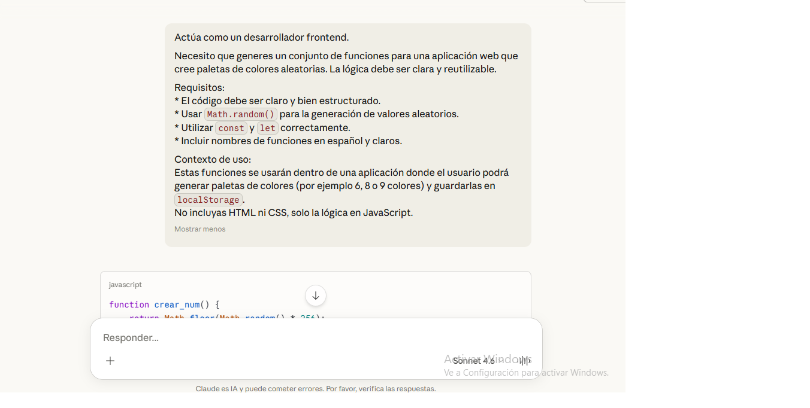

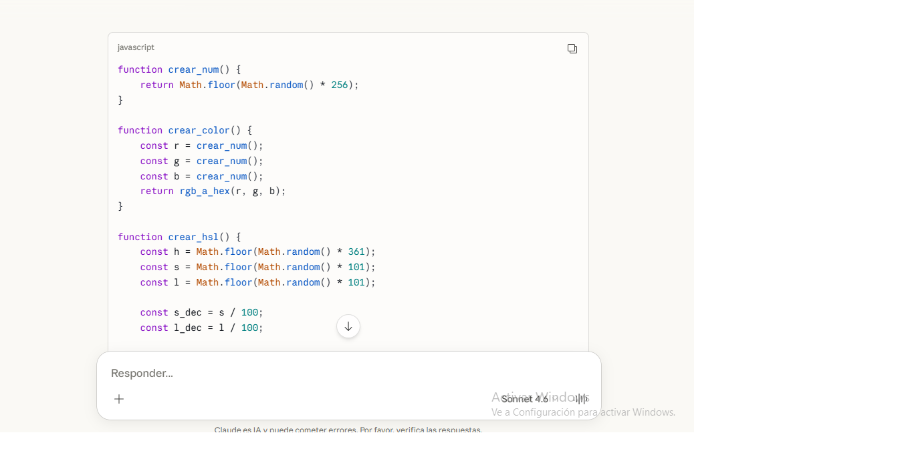

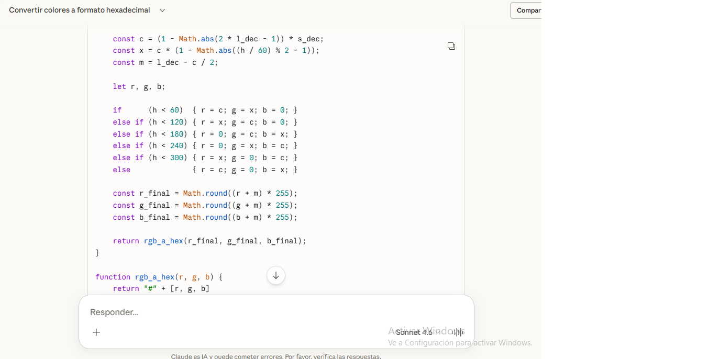

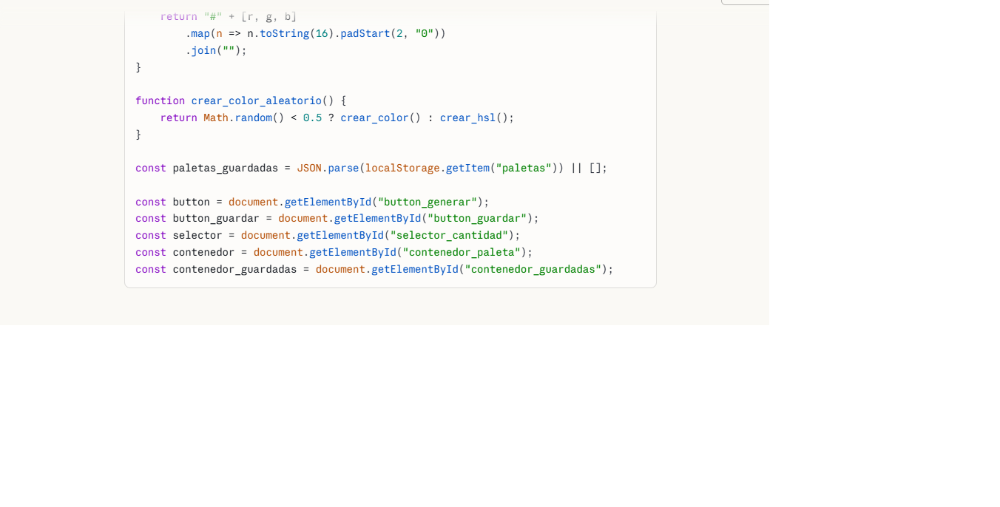

Prompt para los AddEventListener para cantidad de colores y bloquearlos cuando sea necesario.

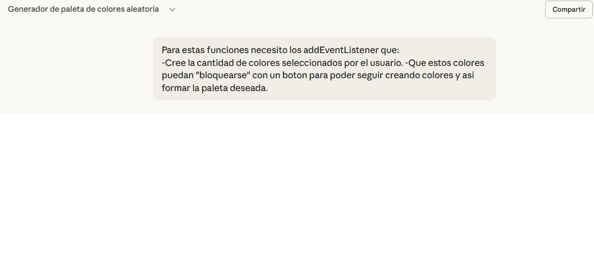

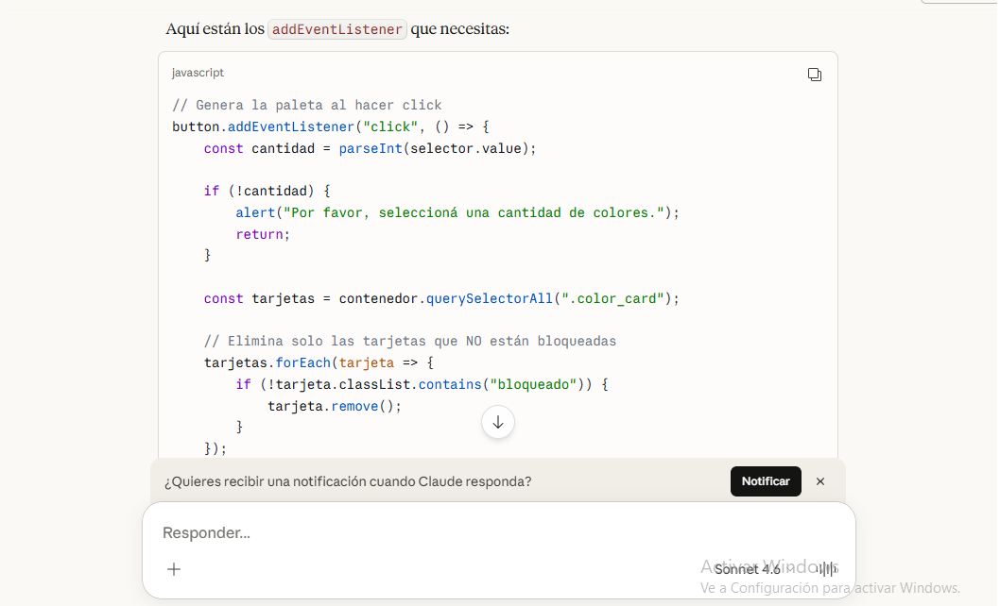

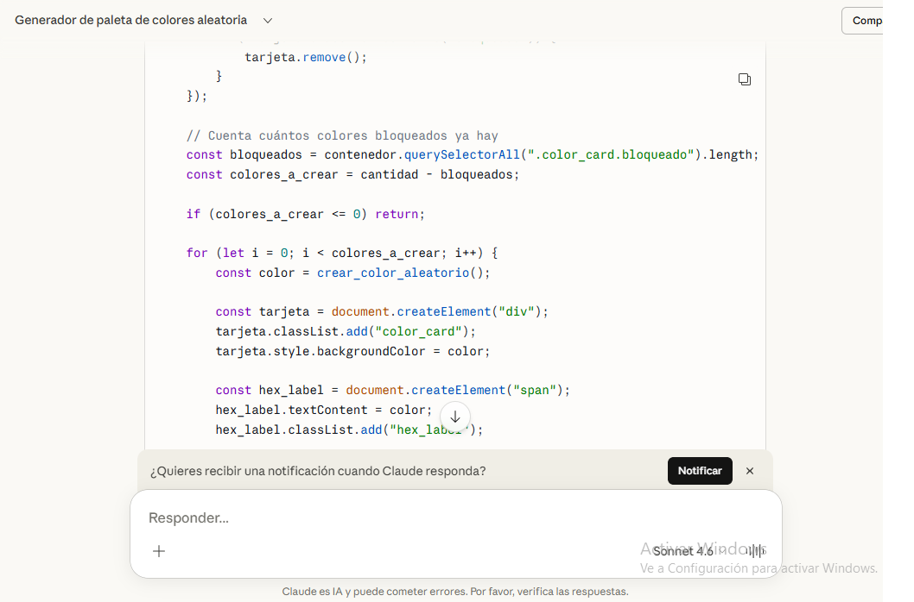

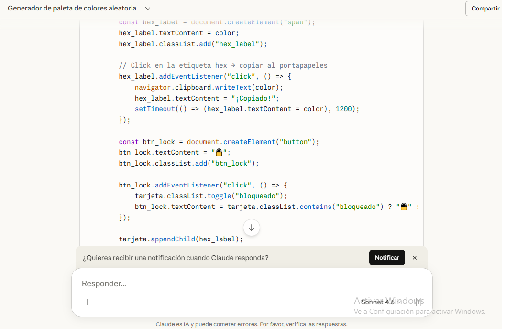

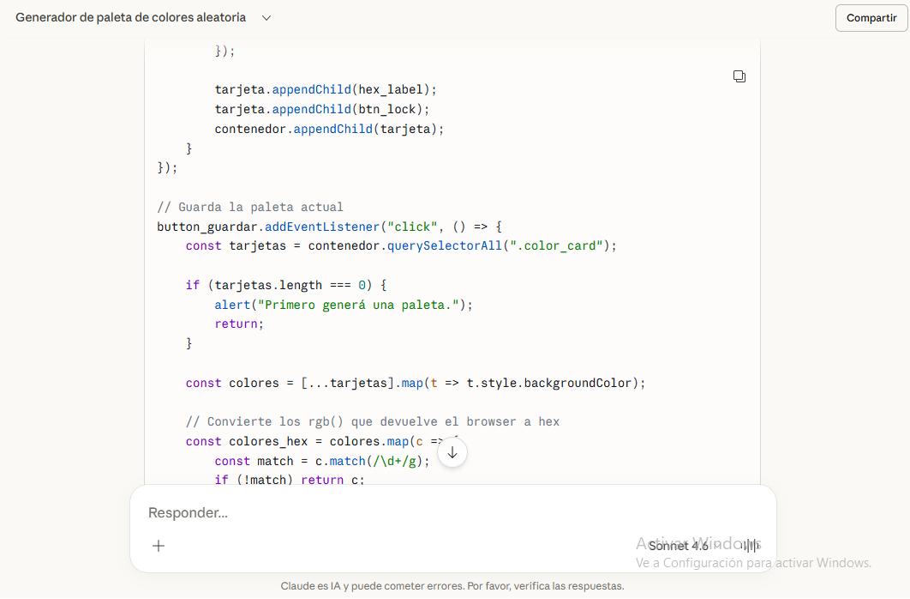

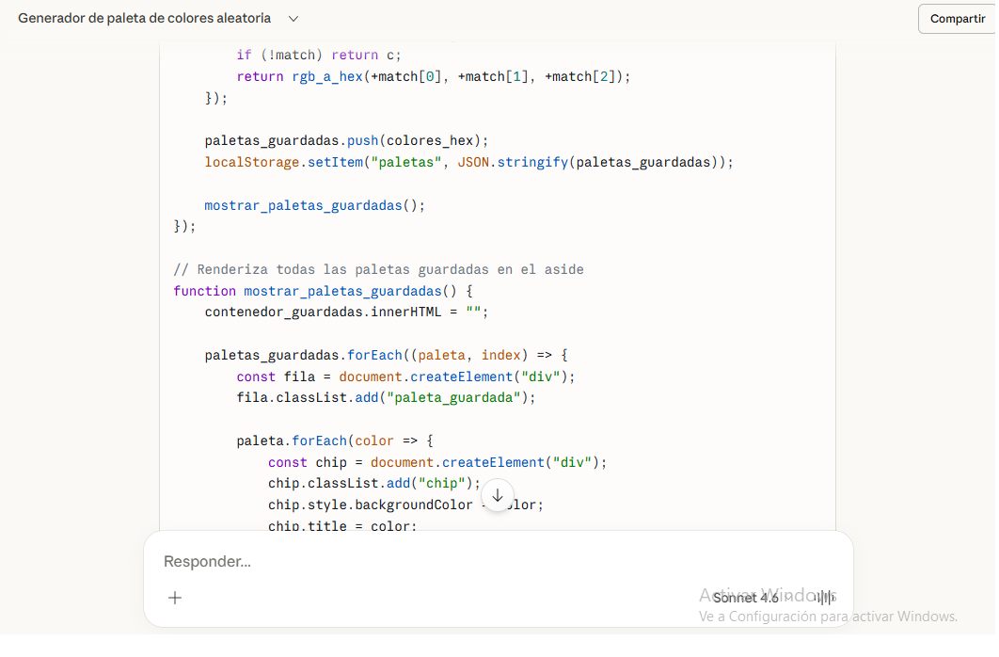

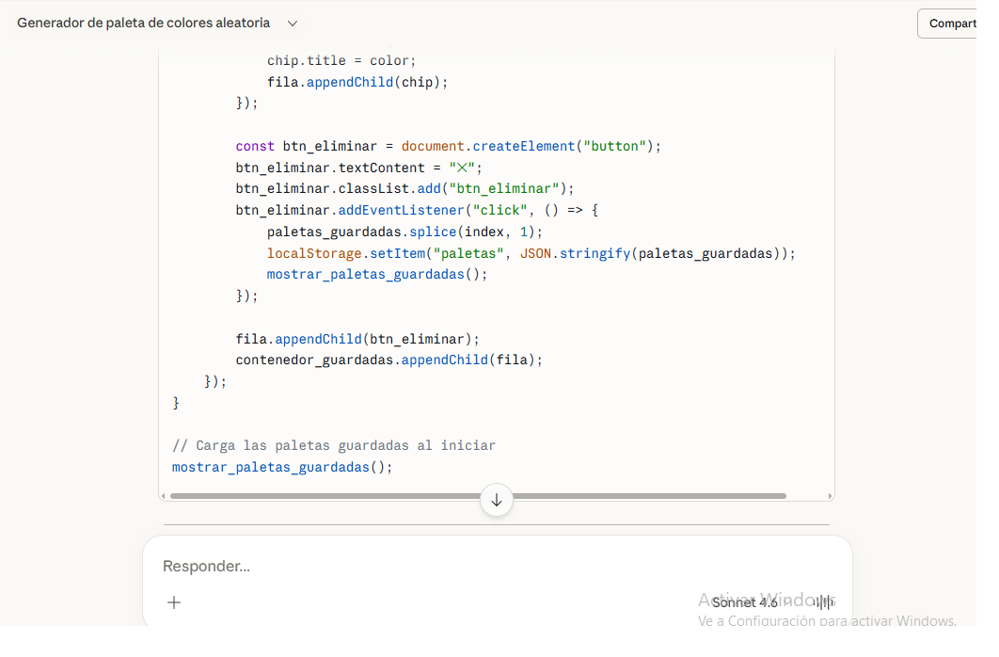

Prompt AddEventListener para guardar paleta creada.

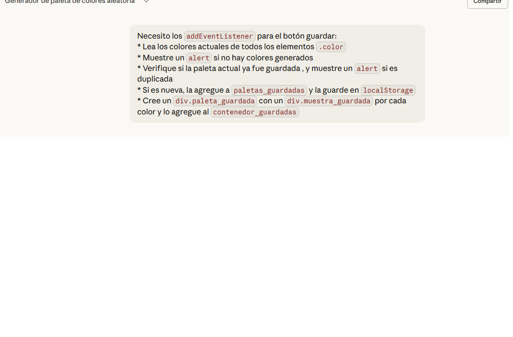

<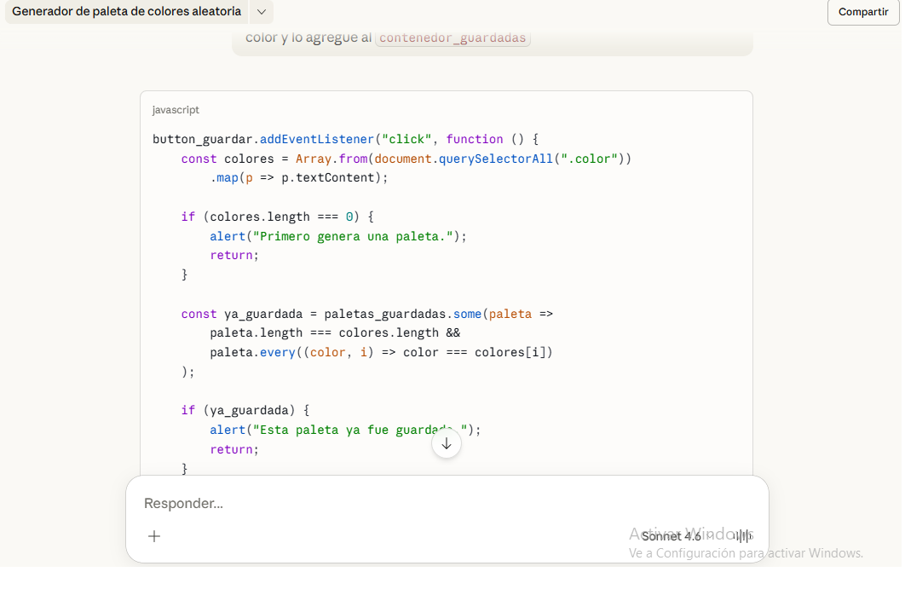

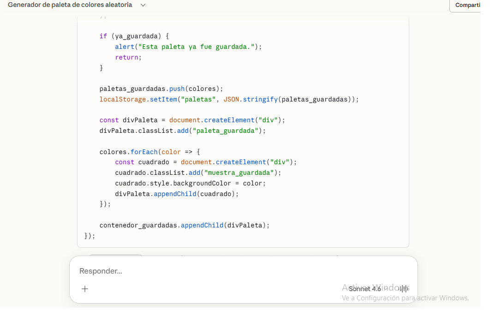