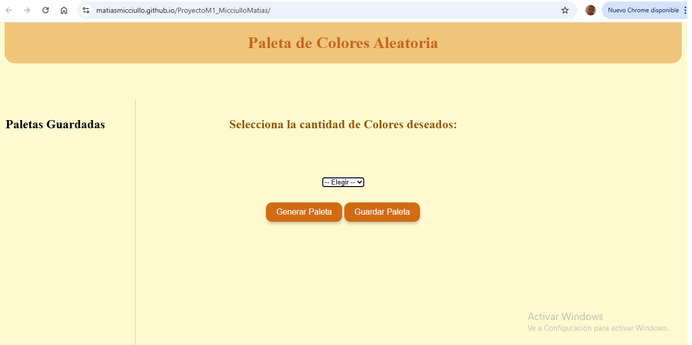
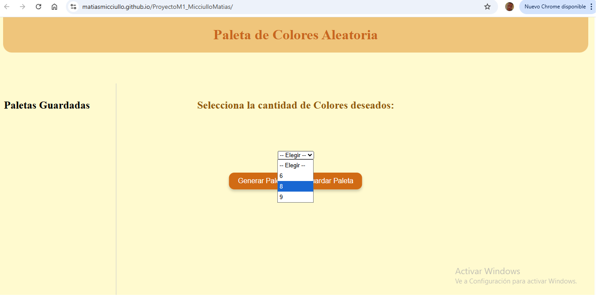
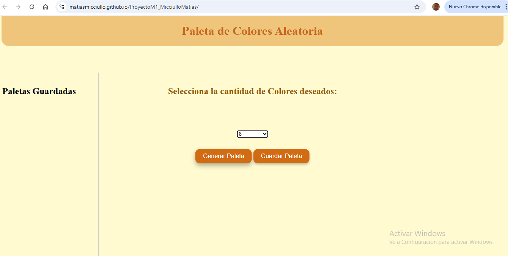
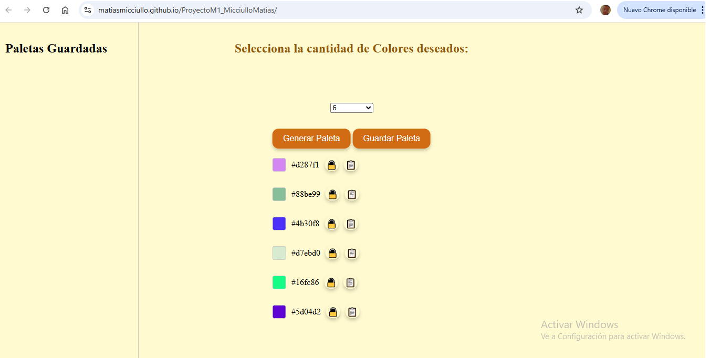
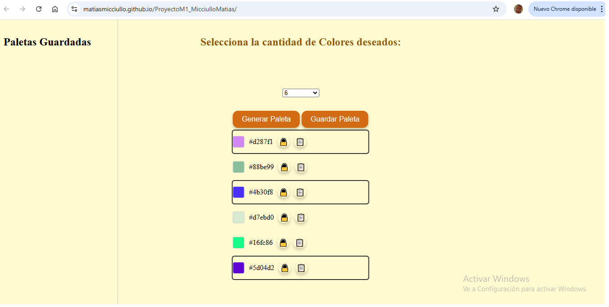
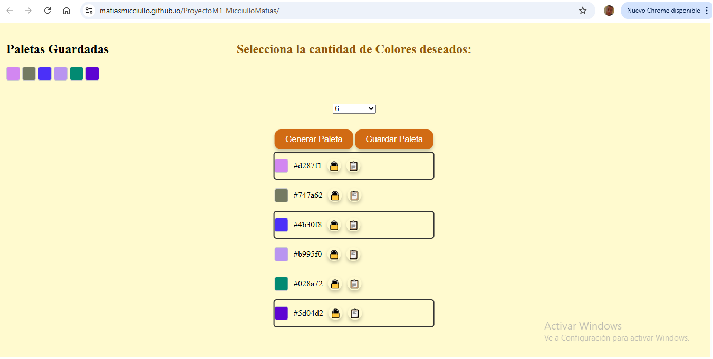
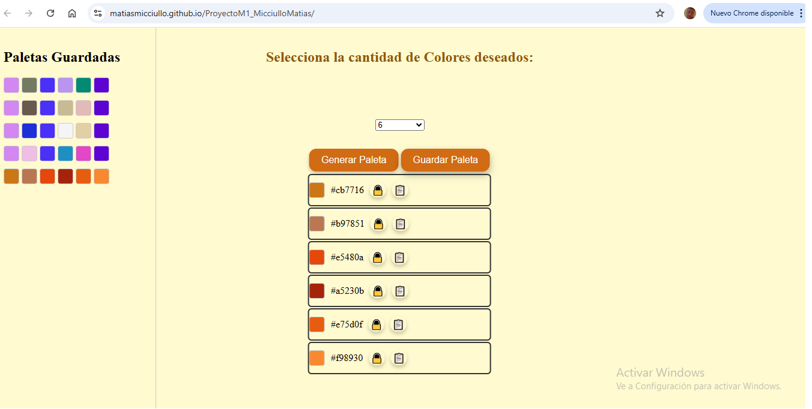

# ProyectoM1_MicciulloMatias
Proyecto integrador Modulo 1 - Curso Full Stack Henry

En este trabajo hemos creado una app web estática que generará una paleta de colores aleatorias, dando la posibilidad al usuario de bloquear alguno de esos colores si asi lo desea, conservar la paleta de colores creada si es de su agrado e incluso elegir la cantidad de colores a crear.

El primer paso será elegir la cantidad de colores deseados en la paleta.

Luego de esto, presionando el botón "Generar Paleta", se crea la paleta de colores aleatorios según la cantidad de colores seleccionados.

Una vez creada la paleta de colores, el usuario puede bloquear uno o más colores si son de su agrado con el simbolo de "Candado" que se encuentra al lado de cada color.

También es posible conservar la paleta generada con el botón "Guardar Paleta".

Asi de este modo, bloqueando los colores deseado y continuando a generar paletas, el usuario puede llegar a crear un Paleta Estética y acorde a sus preferencias.

